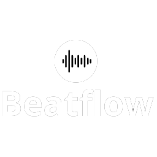

# BEATFLOW NEW RELEASE (PRE-ALPHA VERSION)

<p align="center">
  
</p>

# Introduction
New version of the music desktop app for student programming project called **beatflow**.
Written in HTML, CSS & Javascript is an exciting and powerful music tool designed specifically for students and teachers. With an intuitive interface and advanced features, our program facilitates listening fun.

# Features

* **Listen to unlimited music**

* **Create your own music playlist.**

* **Like your favorite songs** 

* **Personalize your account however you want** 

* **Custom Notifications** 

# System Requirements

* Operating system: Windows 7 / 8 / 10

# Get Started

1. Clone this repository: 

```
https://github.com/mibichoandafugao/BeatFlow.git
```

2. Open the project in your preferred code editor.
3. Compile and run the program.

**Experience music like never before with Beatflow!**

# Documentation
Read the documentation here:

```
https://kyottah.notion.site/Beatflow-Docs-c8d564c145d241a7bbfe2822a033a90a?pvs=4
```

# Contact Us

If you have any questions or comments, feel free to contact our team on instagram:

* `@brisaacarob`

* `@luisv12._`

* `@kyottah`

Or join our Discord server:

```
https://discord.gg/kA7VRyQj
```

# Important notes

This project is currently in the prerelease phase. We appreciate any comments or suggestions to improve the experience of our users.
